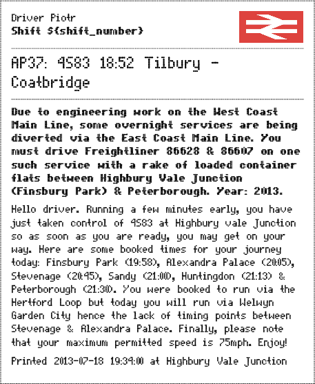

Railworks Dispatcher
====================

Creates a work order by choosing a random scenario from your Railworks folder. Here is
what your work order can look like:

Don't worry! It is created in vector, so it prints nice.

The scenario briefing and description is taken from
`Armstrong Powerhouse's AP37 Scenario pack <http://www.armstrongpowerhouse.com/index.php?route=product/product&path=29_81&product_id=139>`_.

Setup
-----

* Install Python 3.3+ (this dependency will be removed soon). This project is being developed with Python 3.4.2.

* Place in the same folder as your ``railworks.exe``.

Usage
-----

* Unpack using all the RouteDescription.xml files and scenarios you want to be scanned.
  This is very easy using `RWTools <http://www.rstools.info>`_, but you can just as well
  unpack all the files using 7-Zip or similar tool. Since 2014 DTG have started packing
  some assets in ZIP files with .ap extension which Dispatcher is not able to look
  through at the moment for performance reasons. This has been described in detail by Mike,
  the author of RW-Tools, in his `*.AP file tutorial <http://www.rstools.info/RW_Tools_and_APfiles.pdf>`_.
  If you ever 'Verify integrity of game cache' using steam client you'll have to perform the unpacking again.

* If you want to make sure you've unpacked everything correctly just run ``python dispatcher.py --list``
  and you'll get the list of all scenarios available to Railworks Dispatcher grouped by routes.
  Any scenario or route that you don't see here is not available for the Dispatcher.

* Run from console using ``python dispatcher.py`` - you will be asked about how many work
  orders you'd like to generated at once. A uniquely numbered HTML file will be generated
  in WorkOrders folder inside your Railworks installation and opened in your default browser.

* You can also specify duration / number of work orders to create on the command line, e.g.:

  * ``python dispatcher.py 1h`` or ``python dispatcher.py 60m``

  * ``python dispatcher.py 2``

Acknowledgements
----------------

* The created work order uses dot matrix fonts created by
  `Svein Kåre Gunnarson <http://dionaea.com/information/fonts.php>`_.

* The logos of Train Operating Companies are properties of their respective owners.
